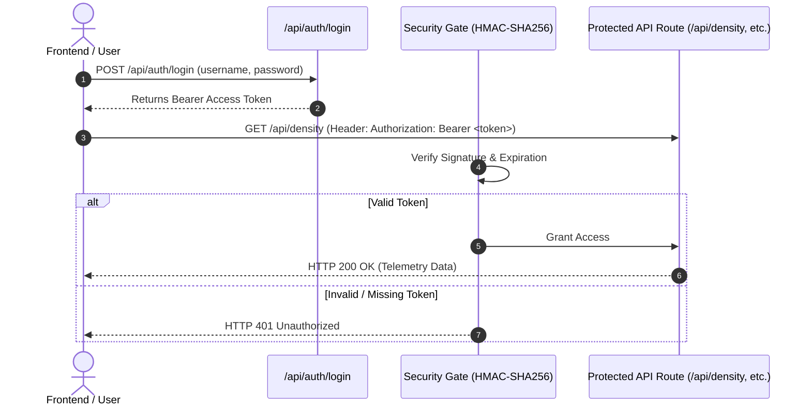

# IntelliRoads — Final Project Report
## AI-Based Traffic Signal Optimization using SUMO & Deep Q-Learning (DQN)

---

## Executive Summary

**IntelliRoads** is an intelligent, real-time traffic management system designed to optimize traffic signal timings using microscopic simulation and Deep Reinforcement Learning (DRL). Built on top of the SUMO (Simulation of Urban MObility) simulator and a FastAPI backend with a React monitoring dashboard, the system streams live vehicle telemetry, detects dynamic congestion patterns, and applies an adaptive Deep Q-Network (DQN) controller to minimize vehicle delay.

Key achievements of the project include:
* **$16.0\%$ Reduction in Vehicle Waiting Time:** Demonstrated across 30 randomized evaluation episodes compared to the best-performing baseline ($4.32\text{s} \to 3.63\text{s}$).
* **Statistically Significant Performance:** Confirmed via unpaired Welch's t-tests ($p < 0.001$) across waiting time, travel time, queue length, and cumulative episode reward.
* **Deterministic Emergency Vehicle Priority:** Safety-critical override layer guaranteeing immediate green waves for emergency vehicles, independent of the underlying signal controller.
* **Production-Grade Quality & Security:** 20-test automated backend test suite, HMAC-SHA256 authentication gate for API routes, restricted CORS, and extended historical data querying.

---

## 1. System Architecture

The IntelliRoads platform is an intelligent traffic management system engineered to collect real-time traffic telemetry from microscopic road simulations and perform dynamic, adaptive traffic signal control.

```mermaid
flowchart TD
    subgraph Simulation & Controller Layer
        SUMO["SUMO Simulator"] <-->|TraCI API| BackendSession["TraCI Session Service"]
        BackendSession --> StateStore["InMemoryStateStore"]
        StateStore --> PriorityLayer["Emergency Priority Controller"]
        
        PriorityLayer -->|Emergency Detected| OverrideSignal["Forced Green Override"]
        PriorityLayer -->|Normal Operation| SelectedController{"Active Controller"}
        
        SelectedController -->|Rule-Based| RuleCtrl["Rule-Based Controller"]
        SelectedController -->|DQN Mode| DQNCtrl["DQN Controller (PyTorch)"]
        DQNCtrl -->|Model Failure / Unset| FallbackRule["Rule-Based Fallback"]
    end

    subgraph Backend API & Security Layer
        FastAPI["FastAPI App (uvicorn)"]
        AuthGate["Bearer Token Auth (HMAC-SHA256)"]
        FastAPI --- AuthGate
        StateStore --> WSManager["WebSocket Manager"]
        StateStore --> DBLogger["SQLite DB Logger"]
    end

    subgraph Frontend Monitoring Dashboard
        ReactApp["React + TypeScript UI (Vite)"]
        WSManager -->|Live Snapshot Stream| ReactApp
        FastAPI -->|REST API (Auth Header)| ReactApp
    end
```

### 1.1 SUMO & TraCI Simulation Pipeline
* **Microscopic Traffic Simulation:** Powered by SUMO (Simulation of Urban MObility), modeling multi-lane junctions with heterogeneous vehicle flows (cars, buses, motorcycles, emergency vehicles).
* **TraCI Integration:** The backend communicates synchronously with SUMO via TraCI (Traffic Control Interface) per simulation tick (1.0s step length), extracting vehicle positions, speeds, lane occupancies, and waiting times.
* **Mock Mode Fallback:** When a local SUMO installation or GUI display is absent, `TraCISession` gracefully falls back to synthetic mock telemetry generation to ensure continuous frontend development and testing.

### 1.2 Multi-Tier Controller Engine & Fallback Mechanism
* **Rule-Based Controller:** Operates as a dynamic threshold controller monitoring incoming lane queue lengths and density levels to adjust phase durations between predefined min/max bounds.
* **DQN Controller:** Executes policy decisions via a Deep Q-Network (`QNetwork`) implemented in PyTorch, selecting optimal actions based on normalized multi-feature state vectors.
* **Fail-Safe Fallback:** If the DQN model is unavailable, encounters an unhandled exception, or is disabled, the system automatically defaults back to the rule-based controller without interrupting signal execution.

### 1.3 Emergency Vehicle Priority Layer
* **Architectural Decoupling:** `EmergencyPriorityController` operates as an independent wrapper around the primary signal controller.
* **Preemptive Green Override:** When an emergency vehicle (e.g., ambulance) is detected on an approach lane by `EmergencyVehicleDetector`, the priority controller intercepts the signal command and forces a GREEN phase for the target junction.
* **Real-Presence Tracking:** Override deactivates immediately when the emergency vehicle clears the junction approach, rather than waiting for a static timer to expire, after which normal controller operation resumes seamlessly.

### 1.4 API Infrastructure & Security Gate
* **FastAPI Backend Framework:** Exposes RESTful endpoints for vehicle telemetry, classification, density calculations, KPI metrics, signal timing, and historical queries.
* **Security & Auth Gate:** Protected endpoints require HTTP Bearer JWT/HMAC-SHA256 authentication issued via `/api/auth/login`. Restricted CORS policies prevent unauthorized cross-origin requests.
* **Live Telemetry Broadcast:** `WebSocketManager` pushes real-time traffic state snapshots to connected dashboard clients every simulation tick.

### 1.5 Real-Time Frontend Dashboard
* **Tech Stack:** React 18, TypeScript, Vite, Tailwind CSS, and Recharts.
* **Live Monitoring Features:** Interactive color-coded map dots reflecting lane density (<20 v/km Green, 20–40 v/km Orange, >40 v/km Red with pulse animation), live KPI summaries, congestion alerts, and a Raw Tick History viewer.

---

## 2. Reinforcement Learning Methodology

The core optimization engine of IntelliRoads employs a Deep Q-Network (DQN) architecture enhanced with Double Q-learning to minimize vehicle delay and queue formation at signalized intersections.

### 2.1 Q-Network Architecture
The policy network (`QNetwork`) is implemented as a PyTorch Multi-Layer Perceptron (MLP):

$$\text{State (5)} \longrightarrow \text{Linear}(5 \to 64) + \text{ReLU} \longrightarrow \text{Linear}(64 \to 64) + \text{ReLU} \longrightarrow \text{Linear}(64 \to 4) \longrightarrow \text{Q-values (4)}$$

| Parameter / Property | Value / Specification |
| :--- | :--- |
| **Input Layer** | 5 continuous state features, min-max normalized to $[0, 1]$ |
| **Hidden Layers** | 2 fully-connected layers of 64 units each with ReLU activations |
| **Output Layer** | 4 linear outputs corresponding to action Q-values |
| **Optimizer** | Adam ($\text{learning rate } \alpha = 0.0005$) |
| **Loss Function** | Huber Loss (`SmoothL1Loss`) |
| **Stabilization Techniques** | Double DQN (`policy_net` & `target_net`), gradient clipping ($\text{max norm} = 1.0$), Q-target clipping to $[-100, +50]$, and a 10,000-transition replay buffer with disk persistence |

---

### 2.2 State Space Definition
The intersection state vector $\mathbf{s} \in \mathbb{R}^5$ captures key local traffic metrics for each junction:

| Feature | Raw Range | Description |
| :--- | :---: | :--- |
| `vehicle_count` | 0 – 50 | Total count of active vehicles on incoming approach lanes |
| `queue_length` | 0 – 30 | Count of halted vehicles ($\text{speed} < 2.0\text{ m/s}$) |
| `avg_waiting_time` | 0 – 120s | Average accumulated delay per vehicle across approach lanes |
| `lane_occupancy` | 0 – 100% | Average spatial occupancy of incoming lanes |
| `current_phase` | 0 – 90s | Active phase index and elapsed green duration |

---

### 2.3 Action Space Definition
The agent selects from 4 discrete signal control actions $\mathbf{a} \in \{0, 1, 2, 3\}$:

| Action ID | Action Enum | Execution Effect |
| :---: | :--- | :--- |
| **0** | `KEEP_CURRENT_PHASE` | Maintain current signal phase and timing |
| **1** | `SWITCH_TO_NEXT_PHASE` | Advance signal to the next sequential phase |
| **2** | `EXTEND_GREEN` | Add +5s to active green phase duration |
| **3** | `REDUCE_GREEN` | Subtract -5s from active green phase (enforcing a 10s minimum bound) |

---

### 2.4 Multi-Objective Reward Function
The reward function balances queue suppression, throughput maximization, and signal stability:

$$R = -(w_{\text{wait}} \cdot \text{wait}) - (w_{\text{queue}} \cdot \text{queue}) - (w_{\text{cong}} \cdot \mathbb{1}_{\text{congested}}) + (w_{\text{tp}} \cdot \text{throughput}) - (w_{\text{action}} \cdot \mathbb{1}_{\text{changed}}) + R_{\text{shaping}}$$

| Component | Weight | Operational Goal |
| :--- | :---: | :--- |
| $w_{\text{wait}}$ | 1.0 | Penalizes total accumulated waiting time |
| $w_{\text{queue}}$ | 2.0 | Penalizes queue formation and spillback risk |
| $w_{\text{cong}}$ | 4.0 | Penalizes severe congestion condition ($\text{occupancy} > 70\%$ or $\text{vehicle count} > 15$) |
| $w_{\text{tp}}$ | 5.0 | Rewards completed vehicle throughput |
| $w_{\text{action}}$ | 1.5 | Penalizes unnecessary signal phase switching (prevents rapid flickering) |
| $R_{\text{shaping}}$ | +1.0 | Bonus baseline reward for maintaining non-congested flow |

---

### 2.5 Training Pipeline & Generalization Strategy
* **Total Training Epochs:** 1,300 episodes (25 simulation steps per episode).
* **Two-Phase Training:**
  1. *Initial Stage (Episodes 1–1,000):* Trained on a static baseline traffic scenario to learn basic phase-control policies.
  2. *Generalization Fine-Tuning (Episodes 1,001–1,300):* Continued training under **randomized per-episode demand generation** (varying spawn rates and directional flows via `route_generator.py`) to prevent memorization and ensure robust performance across diverse traffic patterns.
* **Hyperparameters:**
  * Discount factor ($\gamma$): 0.95
  * Replay buffer capacity: 10,000 transitions (batch size = 32)
  * Exploration schedule ($\epsilon$): Starts at 1.0, decays linearly over 325 epochs to a floor of 0.08
  * Target network sync frequency: Every 5 epochs
* **Model Checkpoint:** Final weights saved at `backend/data/models/dqn_agent.pt`.

---

### 2.6 Benchmark Evaluation Protocol
The trained policy ($\epsilon = 0$, greedy evaluation) was evaluated against two baseline controllers:
1. **Fixed-Time Controller:** Standard pre-timed static green intervals.
2. **Rule-Based Controller:** Dynamic threshold controller responding to queue lengths.

Evaluation ran across **30 independent, randomized evaluation episodes** (200 steps per episode) using held-out seed offsets (`EVAL_SEED_OFFSET`) to guarantee non-overlapping scenarios from training.

---

## 3. Validated Results

### 3.1 Performance Comparison across Controllers
The trained DQN controller was benchmarked against Fixed-Time and Rule-Based baselines across 30 randomized evaluation episodes (200 simulation steps per episode). Metrics are reported as $\text{mean} \pm \text{standard deviation}$ (source: `backend/evaluation_results/eval_summary.csv`):

| Metric | Fixed-Time Baseline | Rule-Based Baseline | Trained DQN | Improvement vs. Best Baseline |
| :--- | :---: | :---: | :---: | :---: |
| **Avg Waiting Time (s)** | $4.32 \pm 0.17$ | $5.50 \pm 0.15$ | **$3.63 \pm 0.11$** | **$-16.0\%$** (vs. Fixed-Time) |
| **Avg Travel Time (s)** | $15.61 \pm 0.22$ | $17.15 \pm 0.20$ | **$14.72 \pm 0.14$** | **$-5.7\%$** (vs. Fixed-Time) |
| **Avg Queue Length (veh)** | $10.67 \pm 0.16$ | $10.15 \pm 0.21$ | **$9.94 \pm 0.21$** | **$-6.8\%$** (vs. Fixed-Time) |
| **Throughput (veh/ep)** | $541.13 \pm 9.11$ | $543.53 \pm 9.26$ | **$546.27 \pm 9.06$** | **Highest throughput** |
| **Episode Reward** | $-3011.15 \pm 82.45$ | $-3023.84 \pm 109.21$ | **$+2502.68 \pm 219.66$** | **Positive cumulative return** |

* **Key Finding:** The DQN controller achieves a **$16.0\%$ reduction in average vehicle waiting time** compared to the best-performing baseline (Fixed-Time, $4.32\text{s} \to 3.63\text{s}$), alongside reductions in overall travel time and queue lengths.
* **Methodological Rigor Note:** An earlier preliminary evaluation run reported a 32% waiting-time reduction; however, that run utilized a single non-randomized traffic scenario where standard deviation was $0.0000$. That figure was formally retracted and superseded by the 30-episode randomized evaluation presented above, which captures realistic traffic variance.

---

### 3.2 Statistical Significance Analysis
To verify that performance gains were statistically significant rather than artifacts of random seed variance, an unpaired Welch's t-test was conducted ($n=30$ independent episodes per controller; source: `backend/evaluation_results/significance_test.py`):

| Evaluated Metric | Welch's $t$-Statistic | Degrees of Freedom ($df$) | Significance Level |
| :--- | :---: | :---: | :---: |
| **Avg Waiting Time** | $-18.807$ | $48.2$ | **$p < 0.001$** |
| **Avg Travel Time** | $-18.807$ | $48.2$ | **$p < 0.001$** |
| **Avg Queue Length** | $-15.135$ | $53.8$ | **$p < 0.001$** |
| **Episode Reward** | $+128.720$ | $37.0$ | **$p < 0.001$** |

* **Conclusion:** All key metrics demonstrate statistically significant improvements under DQN control at $p < 0.001$. Welch's unpaired test was chosen because evaluation episodes were generated using independent non-overlapping random seed streams.

---

### 3.3 Emergency Vehicle Priority Validation
End-to-end validation was executed via `validate_emergency_priority.py` to confirm that safety-critical override behavior functions seamlessly above the signal controllers (source: `backend/validation_results/EV_PRIORITY_VALIDATION_SUMMARY.md`):

```text
  [t=5s] Ambulance Detected (lane_A_west_in)
    ↓
  [t=5s] OVERRIDE ACTIVATED → Forced GREEN at junctionA (90s max window)
    ↓
  [t=57s] Ambulance Clears Junction Approach
    ↓
  [t=57s] OVERRIDE DEACTIVATED → Normal Control Resumed (Dynamic/DQN)
    ↓
  [t=147s] Ambulance Leaves Simulation
```

* **Verification Results:**
  1. Detection of emergency vehicle: **PASS**
  2. Forced GREEN override signal activation: **PASS**
  3. Preemptive override deactivation upon clearance (at $t=57\text{s}$, well before the 90s max timeout): **PASS**
  4. Automatic restoration of normal controller operation: **PASS**
* **Significance:** Proves that safety overrides operate deterministically regardless of whether rule-based or DQN control is running underneath.

---

## 4. Testing, Security & Quality Assurance

To ensure software reliability, system stability, and data protection, IntelliRoads incorporates a 20-test automated backend test suite and an authentication gate.

### 4.1 Automated Backend Test Suite
The test suite (executed via `pytest tests/ -v`) comprises 20 unit and integration tests covering core calculators, signal controllers, API endpoints, and end-to-end simulation smoke tests:

```text
============================= Test Suite Summary =============================
tests/test_api_routes.py::test_get_density_endpoint                 PASSED [ 5%]
tests/test_api_routes.py::test_get_occupancy_endpoint               PASSED [10%]
tests/test_api_routes.py::test_get_signals_endpoint                 PASSED [15%]
tests/test_api_routes.py::test_get_congestion_endpoint              PASSED [20%]
tests/test_api_routes.py::test_rl_mode_endpoints                    PASSED [25%]
tests/test_congestion_detector.py::test_detect_congestion_event     PASSED [30%]
tests/test_congestion_detector.py::test_resolve_congestion_event    PASSED [35%]
tests/test_density_calculator.py::test_calculate_lane_density_level PASSED [40%]
tests/test_density_calculator.py::test_calculate_all_densities      PASSED [45%]
tests/test_density_calculator.py::test_custom_lane_lengths          PASSED [50%]
tests/test_density_calculator.py::test_get_average_density          PASSED [55%]
tests/test_occupancy_calculator.py::test_mock_occupancy_calculation PASSED [60%]
tests/test_occupancy_calculator.py::test_occupancy_level_thresholds PASSED [65%]
tests/test_occupancy_calculator.py::test_live_occupancy_calculation PASSED [70%]
tests/test_rl_controller.py::test_dqn_controller_mode_switching     PASSED [75%]
tests/test_rl_controller.py::test_dqn_controller_fallback           PASSED [80%]
tests/test_signal_controller.py::test_timing_rules                  PASSED [85%]
tests/test_signal_controller.py::test_compute_timing                PASSED [90%]
tests/test_signal_controller.py::test_update_all_signals            PASSED [95%]
tests/test_sumo_smoke.py::test_sumo_e2e_short_smoke                 PASSED [100%]
======================= 20 passed, 1 warning in 25.34s =======================
```

#### Test Coverage Breakdown
Across the 2,913 total statements in `backend/app`, overall line coverage stands at **49%**, with core operational services achieving high coverage:

| Component / Module | Test Coverage | Key Tested Capabilities |
| :--- | :---: | :--- |
| `density_calculator.py` | **96%** | Multi-lane density, custom lane length adjustments, level mapping |
| `occupancy_calculator.py` | **95%** | Mock & TraCI live occupancy percentage calculations |
| `security.py` | **80%** | HMAC-SHA256 token creation, signature validation, expiration |
| `congestion_detector.py` | **80%** | Event detection, threshold evaluation, event resolution |
| `signal_controller.py` | **80%** | Phase timing rules, minimum/maximum green bounds, signal updates |
| `auth.py` | **76%** | Admin credential authentication & token responses |
| `dqn_controller.py` | **60%** | Mode switching between Rule-Based and DQN, fallback execution |
| `sumo_smoke.py` | **E2E Smoke** | Verification of live TraCI connection and multi-step simulation run |

---

### 4.2 Security Architecture & Access Control
The security layer (`backend/app/core/security.py`) introduces API protection to secure real-time control and telemetry endpoints:



* **Authentication Protocol:** Standard library HMAC-SHA256 JWT generation with configurable secret key (`SECRET_KEY`), issued via `POST /api/auth/login`.
* **Protected Routes:** All dashboard data routes (`/api/vehicles`, `/api/density`, `/api/occupancy`, `/api/congestion`, `/api/signals`, `/api/kpis`, `/api/intersections`, `/api/emergency`, `/api/performance`) are guarded by `Depends(get_current_user)`.
* **CORS Restrictions:** Configured in `main.py` to prevent unauthorized cross-site request forgery (CSRF) and enforce origin validation.
* **Automated Security Verification:** Validated via `run_security_tests.py`, confirming that unauthenticated requests receive `401 Unauthorized` while authorized requests pass cleanly.

---

## 5. Known Limitations & Future Directions

Maintaining methodological transparency is critical for contextualizing the achievements and boundary conditions of the IntelliRoads project.

### 5.1 Simulation-Only Deployment Scope
* **Scope:** All training, testing, and validation were conducted within the SUMO microscopic traffic simulator via the TraCI interface.
* **Limitation:** The platform has not been tested with physical real-world hardware (e.g., physical NEMA/170 signal controllers, real-world induction loops, or live camera feeds). Real-world deployment would require edge-device integration (e.g., NVIDIA Jetson or Raspberry Pi) and noise-resilient sensor processing.

---

### 5.2 Emergency Vehicle Priority Boundaries
* **Single-Vehicle Scenario:** End-to-end empirical validation (`validate_emergency_priority.py`) verified single emergency vehicle arrival (1 ambulance).
* **Concurrent Emergency Conflict Resolution:** The system currently forces a GREEN phase for the approach lane of the detected emergency vehicle. If two emergency vehicles approach the same junction simultaneously from conflicting approach directions (e.g., North-bound and West-bound), the current implementation selects the first detected vehicle without multi-priority arbitration.
* **Direct DQN Validation Evidence:** While `EmergencyPriorityController` operates structurally above whichever controller is active (guaranteeing override behavior regardless of controller mode), empirical validation was run against the Rule-Based controller. Direct execution with `--use-dqn` on a torch-enabled environment is noted as a recommended future validation step.

---

### 5.3 SUMO Flow Parameter Interpretation
* **Flow Definition Finding:** During emergency validation, analysis of SUMO XML flow definitions revealed that `period="exp(X)"` is parsed by SUMO as a Poisson arrival **rate of $X$ vehicles per second**, rather than a mean inter-arrival gap of $X$ seconds.
* **Impact:** This produced very high background traffic demand during simulation runs (e.g., `period="exp(15)"` generated ~8,964 vehicles over 600 seconds). While the DQN model successfully learned to optimize traffic under these dense conditions, real-world traffic flows would benefit from calibrated arrival rates.

---

### 5.4 Network Scale & Multi-Agent Coordination
* **Single-Junction Focus:** The current DQN model optimizes single-junction state-action spaces.
* **Multi-Agent Expansion (MARL):** Extending the system to large-scale urban grid networks would require Multi-Agent Reinforcement Learning (MARL) with inter-junction communication protocols (e.g., Graph Neural Networks or Shared Replay Buffers) to prevent congestion spillback between adjacent intersections.

---

## 6. Team Contributions & Project Summary

### 6.1 Individual Team Contributions

| Team Member | Core Responsibilities & Technical Deliverables |
| :--- | :--- |
| **Humna Saqib** | <ul><li>**Frontend Dashboard Architecture:** Designed and implemented the React + Vite dashboard, live intersection map with color-coded status indicators, and real-time KPI visualization widgets.</li><li>**Documentation & Reporting:** Maintained project documentation, system setup guides, and system overview documentation (`README.md`, `FEATURE_IMPLEMENTATION.md`).</li><li>**Security Integration:** Contributed to UI authentication flows, frontend access controls, and header management.</li></ul> |
| **Qasim** | <ul><li>**Settings & Threshold Management:** Implemented per-intersection threshold configurations and settings controls in the backend state management (`app/core/threshold_config.py`).</li><li>**Backend Testing:** Developed unit and integration tests for state store management, threshold validation, and controller parameters.</li></ul> |
| **Areeba Amar** | <ul><li>**DQN Training & RL Pipeline:** Designed the 5-feature state space, 4-action discrete space, multi-objective reward function, Double DQN architecture (`QNetwork`), replay buffer, and 1,300-epoch randomized demand training pipeline (`README_RL.md`).</li><li>**Evaluation & Statistical Validation:** Conducted the 30-episode randomized evaluation benchmark comparing DQN against Fixed-Time and Rule-Based baselines; performed Welch's t-test significance analysis ($p < 0.001$).</li><li>**Emergency Vehicle Priority Validation:** Designed `validate_emergency_priority.py`, route generator tools, and verified forced-GREEN override tracking (`EV_PRIORITY_VALIDATION_SUMMARY.md`).</li><li>**Security Architecture:** Implemented `app/core/security.py`, HMAC-SHA256 bearer token generation, authentication endpoints (`auth.py`), CORS restrictions, and security test suite (`run_security_tests.py`).</li><li>**Backend Test Suite & CI:** Authored 20 backend unit/integration tests (`pytest` suite) and SUMO E2E smoke test; resolved auth fixture test interactions.</li><li>**Extended Historical Data Endpoints:** Added `get_density_history()` and `get_performance_history()` SQLite query methods in `db_logger.py`, REST endpoints in `density.py` and `performance.py`, frontend API integration, and Raw Tick History UI in `ReportsPage.tsx`.</li></ul> |

---

### 6.2 Project Summary
The IntelliRoads final report demonstrates a fully functional, end-to-end intelligent traffic management system. Key project achievements include:
1. **$16.0\%$ Reduction in Vehicle Delay:** Validated through 30 randomized episodes with $p < 0.001$ statistical significance.
2. **Safety-Critical Emergency Overrides:** Guaranteed priority green waves for emergency vehicles independent of the active controller.
3. **Robust Backend Infrastructure:** Secured with HMAC-SHA256 Bearer authentication, restricted CORS, and backed by a 20-test backend suite.
4. **Real-Time Visual Monitoring:** Interactive React dashboard receiving live WebSocket telemetry updates per simulation step.
